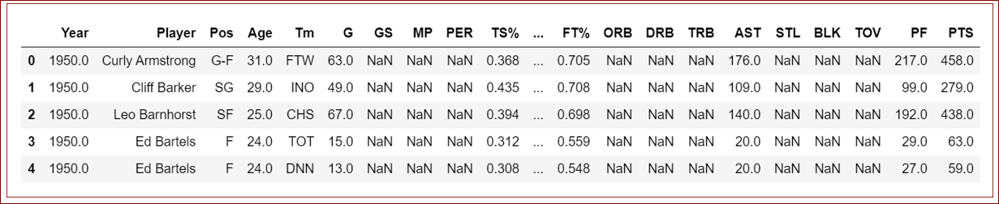
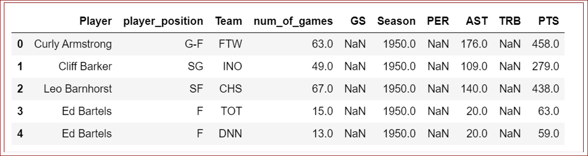
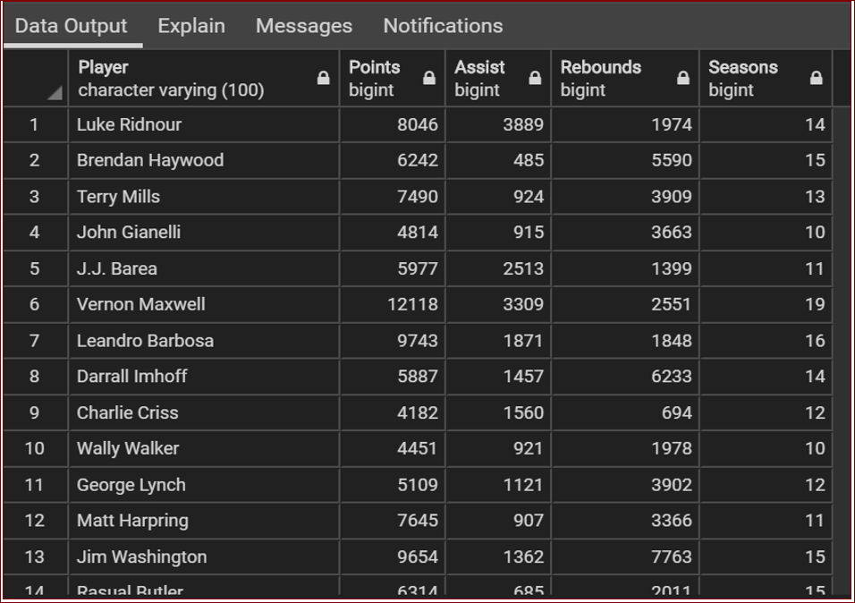

# ETL_Project

#### By: Felix Barron and Gio Leonardo :+1:

[NBA Players stats since 1950](https://www.kaggle.com/drgilermo/nba-players-stats)
•	3000+ players over 60+ Seasons.

Source [data.world](http://daeta.world)

#### Data Sources:
- Seasons_Status.csv
- Player_data.csv

The dataset contains aggregate individual statistics for 67 NBA seasons. from basic box-score attributes such as points, assists, rebounds etc.

#### Summary
We use these datasets in order to compare NBA players with more than ten seasons in order to determine the following stats per player in the above ten-year category. 
- Points
- Rebound
- Assist

#### Extract: 
We pulled two CSV data source (Players_data.csv, and Seasons_Stats.csv) from [data.world](http://data.world) and used them as our source.

#### Transformation of the data:
We imported the two data sources (Players_data.csv, and Seasons_Stats.csv) into Pandas.
We filtered out “Unnamed” column using pandas, we also filtered out unnecessary columns and renamed the final columns. 

##### Load:
Made connection with the Postgres SQL database.
Verified tables that we had already created in SQL via Postgres Admin. 
Finally, loaded the data from Panda DataFrames into the SQL database and verified players and stats were loaded.
 
#### SQL Verification
Conducted data analysis using JOIN and sub query processes to obtain for the following player data.
- Players who played more than 10 seasons.
- Players total points.
- Players total assist.
- Players total rebound.

##### Figure 1: Shows DataFrame before transformation.

##### Figure 2: Shows DataFrame after transformation.

##### Figure 3: Shows SQL Final Data Output

